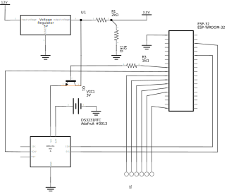
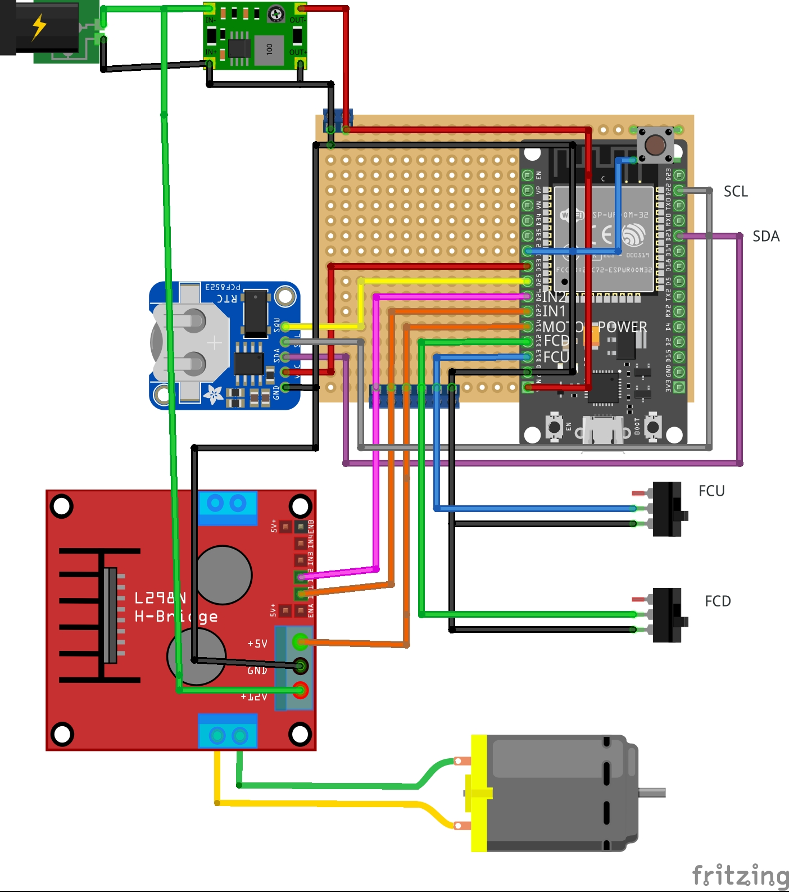

# Oilategi automatizatua
---
###### Hizkuntak: [euskara](./README.md), [castellano](./LEEME.md)
###### [Notak](NOTAK.md)

## Atalak
  - 1 [Hardwarea](#hardwarea)
  	- 1 [Materialak](#materialak)
  	2 [Eskematikoa](#eskematikoa)
  	3 [Irudia](#irudia)
  	4 [Kontsumoa](#kontsumoa)
  2 [Firmwarea](#firmwarea)
  	1 [Helburuak](#helburuak)

## Hardwarea

### Materialak
  * [ESP-32 Doit Kit V1]()
  * [Real Time Clock DS3231](https://docs.zerynth.com/latest/official/board.zerynth.doit_esp32/docs/index.html "Web horri ofiziala")
  * [L298N H-Bridge Module](https://lastminuteengineers.com/l298n-dc-stepper-driver-arduino-tutorial/ "Tutoriala")
  * [Erresistentziak]("Datasheet")
  * [Transistoreak]("Datasheet")
  * [Botoia]()

### Eskematikoa

### Irudia

### Kontsumoa

| **Sinboloa** | **Parametroa**	  | **Min**	| **Normala** | **Max** | **Unitatea** |
|:------------|:-----------------|:--------:|:-----------:|:-------:|:------------:|
| Vin          | Sarrerako boltaia |          |		    5 |		    | 			V |
| VinEsp32     | ESP-32 sarrerako boltaia | 6 | 7 | 20 | V |
| Vbat | Bateriaren boltaia |	9.8  | 12 |	13 | V |
| VRTC | Erlojuaren sarrerako boltaia | 2.3 | 3.3 | 5.5 | V |
| IRTC | Erlojuaren ohizko kontsumoa  | | 200 |  | uA |
| Iin          | Sarrerako korrontea esnaturik | | | | A |
| Isleep_deepESP32 | Sarrerako korrontea lo dagoenean | | 10 | | uA |

## Firmwarea

### Helburuak
* Egunean bitan atea mugitzea. Goizean oilategiaren atea irekitzea eta arratsaldean istea
> Kanpo erlojuarekin, ESP32a lo dagoenean esnatu ahal da honek dauzkan iratzargailuekin eta ESP2aren kanpo iratzar moduarekin.

* Sistema autonomoa izatea, beraz bateria batetik energia hartuko du elikatzeko
> Eguzki plaka batzuekin bateria elikatu ahal da.

* Kontsumo baxua izatea, bateria ahalik eta gehien iraun dezan
> ESP32a berez kontsumo gutxi dauka normalean erabiltzen denean, baina nahi bada lo-moduan jarri ahal da erabiltzen ez denean gutxiago kontsumitzeko. Aldi berean, bertatik esnatzerakoan gainontzeko sistemak piztu ahal dira eta erabiltzen ez direnean gutxiago kontsumitzeko.

* Ahalik eta sinpleen izatea funtzionamendua eta diseinua
> Programa eta eskematikoa ia edozein pertsona ulertu behar du, baoitzak bere kabuz egin dezan.

### Kanpo Liburutegiak
* [DS3232RTC.h](https://github.com/JChristensen/DS3232RTC)
  Kanpo erlojua kontrolatzeko behar den liburutegia da. Oso erabilgarria eslojuaren mikrotxiparen programa guztiak kontrolatzeko.
* [Streaming.h](http://arduiniana.org/libraries/streaming/)
  C++ estiloa gustuko duten pertsonentzat egindako libutegia non bakarrik idazkera aldatzen da.

### Funtzionamendua
